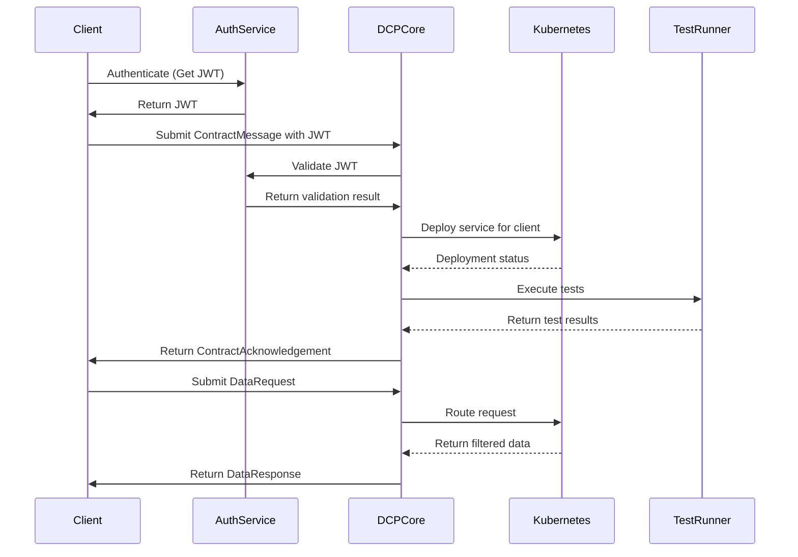

# Dynamic Contract Protocol (DCP)

Dynamic Contract Protocol (DCP) is designed to transform how APIs are defined, consumed, and managed. Instead of relying on static documentation or manual onboarding, DCP enables dynamic, contract-driven API interactions that are secure, validated, and scalable. By using declarative contracts, clients specify exactly what data they need, and servers generate the necessary API behavior automatically. This approach simplifies integration across diverse systems and supports AI-driven API generation.

---

## 🎯 Goal

DCP (Dynamic Contract Protocol) aims to eliminate the need for traditional static documentation tools like Swagger or manual API onboarding.  
Instead, clients can interact with a single, dynamic endpoint using declarative contracts, specifying only the data they need.  
The system generates validation, access control, and execution logic on the fly — enabling self-service data access across distributed systems.

The ultimate goal is to simplify integration across domains, support AI-first dynamic API generation, and allow users to define and consume APIs with zero manual documentation.

---

## ✨ Features

- ✅ Dynamic API generation (REST, GraphQL, OData support)
- ✅ JSON & Protobuf contract support
- ✅ Secure JWT and API Key-based authorization
- ✅ Regional data localization & compliance
- ✅ Auto-generated tests and deployment automation
- ✅ Lite mode for resource-constrained environments
- ✅ AI-powered schema and backend generation

---

## 📦 Usage Journey

The process works as follows:

1. The client sends a **ContractMessage** describing the needed data resources.
2. The server replies with a **ContractAcknowledgement** if the contract is valid and accepted.
3. The client then sends a **DataRequest** using the contract-defined structure.
4. The server responds with a **DataResponse** containing the requested data.



### 1. ContractMessage (Request)
```json
{
  "type": "ContractMessage",
  "protocol_version": "1.0",
  "contract": {
    "resources": [
      {
        "name": "Product",
        "operations": ["get", "list"],
        "fields": ["id", "name", "price"],
        "filters": ["price > 100"]
      }
    ],
    "response_formats": ["json"]
  }
}
```

### 2. ContractAcknowledgement (Response)
```json
{
  "type": "ContractAcknowledgement",
  "status": "accepted",
  "endpoints": {
    "rest": "/dcp/client_123/products"
  },
  "expires_at": "2025-03-25T00:00:00Z",
  "expires_in": 3600000,
  "region": "EU",
  "discovery_url": "/dcp/.well-known/discovery",
  "data_request_schema": {
    "type": "object",
    "properties": {
      "type": { "const": "DataRequest" },
      "resource": { "type": "string" },
      "operation": { "type": "string" },
      "parameters": { "type": "object" }
    },
    "required": ["type", "resource", "operation"]
  },
  "data_response_schema": {
    "type": "object",
    "properties": {
      "type": { "const": "DataResponse" },
      "data": { "type": "array" },
      "metadata": { "type": "object" }
    },
    "required": ["type", "data"]
  }
}
```

### 3. DataRequest (Request)
```json
{
  "type": "DataRequest",
  "resource": "Product",
  "operation": "list",
  "parameters": {
    "filters": ["price < 200"],
    "page": 1
  }
}
```

### 4. DataResponse (Response)
```json
{
  "type": "DataResponse",
  "data": [
    { "id": 1, "name": "Phone", "price": 199 }
  ],
  "metadata": {
    "total_records": 1,
    "current_page": 1
  }
}
```

---

## 📄 ContractMessage Schema & Discoverability

To ensure clients can validate and construct `ContractMessage` payloads programmatically, DCP provides a machine-readable schema and a standardized discovery endpoint.

### JSON Schema Definition

Clients should validate contracts against the official schema to ensure compatibility:

```json
"$schema": "https://dcp.example.com/schemas/contract.schema.json"
```

> The full schema is available via `/dcp/.well-known/discovery`.

#### Example ContractMessage Schema Snippet

```json
{
  "title": "ContractMessage",
  "type": "object",
  "required": ["type", "protocol_version", "contract"],
  "properties": {
    "type": { "const": "ContractMessage" },
    "protocol_version": { "type": "string" },
    "contract": {
      "$ref": "#/definitions/Contract"
    }
  },
  "definitions": {
    "Contract": {
      "type": "object",
      "required": ["resources", "response_formats"],
      "properties": {
        "resources": {
          "type": "array",
          "items": { "$ref": "#/definitions/Resource" }
        },
        "response_formats": {
          "type": "array",
          "items": { "enum": ["json", "protobuf"] }
        },
        "region": { "type": "string" },
        "storage_config": { "type": "object" }
      }
    },
    "Resource": {
      "type": "object",
      "required": ["name", "operations", "fields"],
      "properties": {
        "name": { "type": "string" },
        "operations": {
          "type": "array",
          "items": { "type": "string" }
        },
        "fields": {
          "type": "array",
          "items": { "type": "string" }
        },
        "filters": {
          "type": "array",
          "items": { "type": "string" }
        }
      }
    }
  }
}
```

---

### Contract Discovery Endpoint

The following endpoint exposes schema definitions and reusable policy examples:

- **Endpoint**: `GET /dcp/.well-known/discovery`
- **Response**:

```json
{
  "schemas": {
    "ContractMessage": "/schemas/contract.schema.json",
    "DataRequest": "/schemas/data-request.schema.json"
  },
  "opa_examples": [
    {
      "name": "read_only",
      "source": "package dcp.access\nallow {\n  input.method == \"GET\"\n}"
    },
    {
      "name": "admin_crud",
      "source": "package dcp.admin\nallow {\n  input.role == \"admin\"\n}"
    }
  ]
}
```

This endpoint enables clients to bootstrap their contract payloads with confidence.

---

### Policy Submission in Contracts

Policies can be optionally submitted with the contract. These policies are validated during contract processing:

```json
{
  "contract": {
    "resources": [
      {
        "name": "products",
        "operations": ["get", "list"],
        "fields": ["id", "name", "price", "stock"],
        "filters": ["price > 100", "stock > 0"]
      }
    ],
    "policies": [
      {
        "name": "read_only_policy",
        "source": "package dcp.read\n allow { input.method == \"GET\" }"
      }
    ]
  }
}
```

Policies are validated by the Policy Engine and must be scoped to the client namespace.

---

## 📚 Documentation

| Topic | Description |
|-------|-------------|
| [Specification](./docs/dcp-spec-v1.0.md) | Full protocol definition |
| [Examples](./docs/examples) | Sample contracts and requests |
| [Schemas](./schemas) | JSON Schema validators |
| [Validator SDK](./tools/dcp-client-validator) | Client-side filter validator |
| [HackMD Draft](https://hackmd.io/MQw2DfuuR_SfICvUc-4crg?view) | Living document of the current working spec |

---

## 🧪 Getting Started

```bash
git clone https://github.com/gokayokutucu/dcp-spec.git
cd dynamic-contract-protocol
```

> You can read the spec directly or build tooling using the provided schemas and SDKs.

---

## 🧠 Contributing

Want to contribute?

1. Fork this repository
2. Create a new branch (`feature/my-feature`)
3. Make your changes and commit them
4. Open a Pull Request

See [CONTRIBUTING.md](./CONTRIBUTING.md) for full guidelines.

---

## 🗓 Versioning

| Version | Highlights |
|---------|------------|
| v1.0    | Initial stable version: ContractMessage, DataRequest, Lite Profile, AI Engine, GraphQL, OData |
| v1.1    | (Planned) gRPC support, cross-contract joins |
| v2.0    | (Planned) Quantum-safe encryption, decentralized contract marketplace |

Full changelog is available in [CHANGELOG.md](./CHANGELOG.md).

---

## 🔒 License

This project is licensed under the [Apache 2.0 License](./LICENSE).

---

## 🌍 Who is it for?

- Startups: Rapid prototyping and delivery
- Enterprises: Regulated data environments
- API providers: Dynamic interface provisioning with policy enforcement

---

## 📫 Contact

For questions or support, open an issue via [GitHub Issues](https://github.com/gokayokutucu/dcp-spec/issues).
