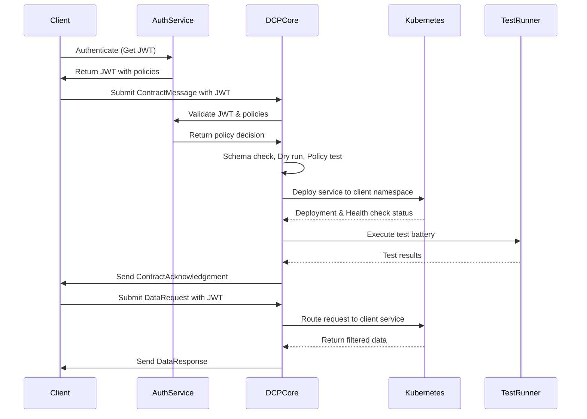
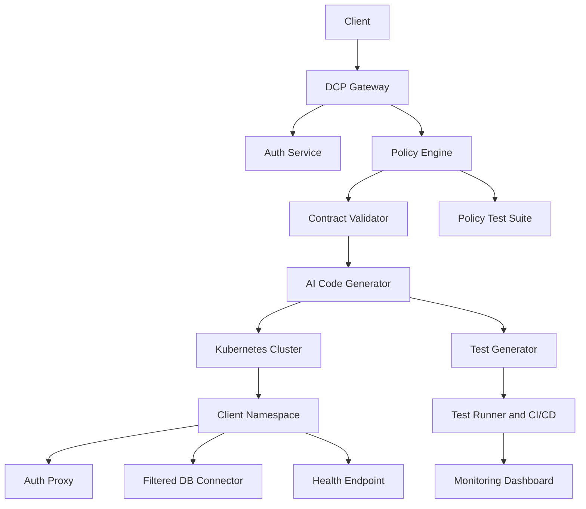
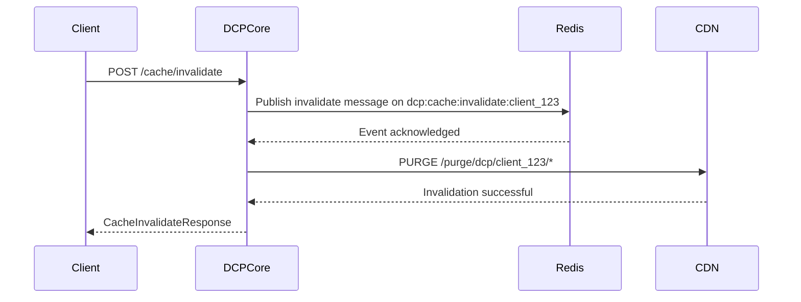

# Dynamic Contract Protocol (DCP) v1.0 Specification

## Purpose
DCP enables clients to dynamically define data resources through JSON/Protobuf contracts, with servers automatically generating API layers. The protocol prioritizes flexibility, security, scalability, and verifiability through a multi-layered validation and test automation architecture.

---

## Communication Model
- **Transport:** HTTP/2 or WebSocket
- **Message Formats:** JSON or Protocol Buffers
- **Required Headers:**
  ```http
  dcp-message-type: ContractMessage|DataRequest
  Authorization: <JWT or API Key>
  ```

---

## Regional Constraints & Data Localization

### Region Field in Contracts
DCP supports optional regional constraints to enable data localization and regulatory compliance. Clients may specify a desired region during contract negotiation.

### Supported Standards
- **Primary:** ISO 3166-1 alpha-2 (e.g., `EU`, `US`, `CN`)
- **Secondary (Optional):** Cloud provider region formats (e.g., `eu-west-1`, `us-east-1`)

### Schema
```json
{
  "type": "ContractMessage",
  "protocol_version": "1.0",
  "contract": {
    "resources": [...],
    "region": "EU", // or "eu-west-1"
    "response_formats": ["json"]
  }
}
```

### Validation
Invalid region codes trigger an `ErrorResponse`:
```json
{
  "type": "ErrorResponse",
  "error": {
    "code": "INVALID_REGION",
    "message": "Region 'XYZ' is not supported",
    "details": {
      "supported_regions": ["EU", "US", "CN", "eu-west-1"]
    }
  }
}
```

### Fallback Handling
```json
{
  "contract": {
    "region": {
      "primary": "EU",
      "fallback": ["US", "CN"]
    }
  }
}
```

Unavailable region handling:
```json
{
  "type": "ErrorResponse",
  "error": {
    "code": "REGION_UNAVAILABLE",
    "message": "Region 'EU' is currently unavailable",
    "details": {
      "suggested_regions": ["US", "CN"]
    }
  }
}
```

### Enforcement Mechanisms
- **Namespace Tagging:**
```yaml
metadata:
  labels:
    dcp_region: EU
```

- **SQL Isolation:**
```sql
SELECT id, name FROM eu_products WHERE namespace = 'client_123';
```

- **OPA Policy:**
```rego
package dcp.region
allow {
  input.contract.region == input.request.region
  input.namespace == input.contract.namespace
}
```

- **Audit Example:**
```json
{
  "event": "data_access",
  "namespace": "client_123",
  "region": "EU",
  "timestamp": "2025-04-15T10:00:00Z"
}
```

---

## Security

### Authentication Methods
| Method       | Format                      | Use Case                |
|--------------|-----------------------------|-------------------------|
| OAuth 2.0    | `Bearer <JWT>`              | Third-party integrations|
| API Key      | `X-API-Key: <key>`          | Machine-to-machine      |
| Custom Token | `X-DCP-Token: <encrypted>`  | Enterprise SSO          |

#### JWT Authentication Flow
1. Client obtains JWT by authenticating via AuthService.
2. JWT includes resource permissions and client namespace.
3. JWT must be presented in Authorization header for each request.

### JWT Claims Structure
```json
{
  "sub": "client_123",
  "dcp_contract": {
    "allowed_resources": ["Product"],
    "allowed_operations": ["get", "list"],
    "field_mask": ["id", "name", "price"],
    "filters": ["stock > 0"]
  },
  "namespace": "client_123",
  "iat": 1700000000,
  "exp": 1735689600,
  "iss": "https://auth.dcp.example.com",
  "aud": "https://api.dcp.example.com"
}
```

### API Key Management
- API keys are generated by the AuthService.
- Keys are scoped to specific client namespaces and contracts.
- Mandatory rotation every 90 days.
- Revocation managed through centralized key management system.

### Authorization Policies
- **RBAC (Role-Based Access Control):**
  - Roles: `admin`, `developer`, `viewer`
  - Permissions predefined per role and managed centrally.
- **ABAC (Attribute-Based Access Control):**
  - Dynamic permissions based on attributes within client contracts.
  - Attributes include resource names, operations, fields, and specific filter criteria.

#### Open Policy Agent (OPA) Policy Example
```rego
default allow = false

allow {
  input.method == "GET"
  input.resource == "Product"
  input.user_contract.allowed_operations[_] == "get"
  input.user_contract.allowed_resources[_] == "Product"
  input.namespace == input.user_contract.namespace
  time.now_ns() < input.token.exp
}
```

##### Additional OPA Policy Examples

- **Read-Only Access Policy**:
```rego
package dcp.access

default allow = false

allow {
  input.method == "GET"
  input.resource == "products"
  input.namespace == input.user_contract.namespace
  input.user_contract.allowed_operations[_] == "get"
}
```

- **CRUD Access for Admin Role**:
```rego
package dcp.admin

default allow = false

allow {
  input.user_contract.role == "admin"
  input.namespace == input.user_contract.namespace
  input.method in ["GET", "POST", "PUT", "DELETE"]
}
```

**Usage**:
Clients can submit these policies to the Policy Engine during contract validation.
Policies are evaluated against JWT claims and request attributes.

### Security Measures
1. **Data Isolation:**
   - Namespace format: `client_{id}` (e.g., `client_123`)
   - Database query injection:
     ```sql
     SELECT {fields} FROM products
     WHERE {client_filters}
     AND namespace = 'client_123'
     ```
2. **Token Security:**
   - JWT tokens with maximum 1-hour TTL.
   - Redis-based revocation: `jwt:blocklist:<hash>`
   - API key rotation policies enforced via Keycloak/Auth0.
3. **Encryption:**
   - TLS 1.3 mandatory for all communications.
   - Field-level AES-256-GCM encryption for sensitive fields.
4. **Audit Logs:**
   - Elasticsearch integration for field-level access tracking.
   - Logs retained for 7 years in compliance with regulatory standards.

### Hardware Enforcement
- **TPM Integration:** Sign generated code artifacts for tamper-proof validation.
- **Secure Key Storage:** API keys/JWT secrets stored in HSM-backed vaults.

---

## Security & Compliance Deep-Dive

### Authentication & Authorization
- **OAuth 2.0:** Standard JWT bearer tokens for third-party integrations.
- **API Key Management:** API keys scoped to specific namespaces and resources with mandatory rotations every 90 days.
- **Custom Tokens:** Enterprise-grade tokens for SSO integrations, with advanced security measures.

### Data Isolation
- Namespaces enforced at the database and container levels to guarantee isolation between clients.
- Rigorous namespace-based RBAC enforced within Kubernetes and service meshes.

### Encryption
- **Data-in-transit:** TLS 1.3 required for all external and internal communications.
- **Data-at-rest:** AES-256-GCM encryption for sensitive data fields.
- Automated certificate rotation via Cert-manager integrated with Kubernetes.

### Token Security
- Short-lived JWT tokens (1-hour TTL) with Redis-based revocation lists (`jwt:blocklist:<hash>`).
- Real-time monitoring of token usage and anomalies.

### Audit Logging
- Elasticsearch or Loki to centrally manage detailed audit logs.
- Field-level logging enabled, tracking each access and modification.
- Compliance logs maintained for at least 7 years.

### Compliance Controls

#### GDPR
- Personal data field masking and anonymization.
- Data subject requests (access, modification, deletion) automated through dedicated API endpoints.

#### GDPR/CCPA Data Deletion
1. `DELETE /_data_requests` endpoint triggers namespace-wide data erasure.  
2. Blockchain-backed audit trail for deletion requests.  
3. 7-day grace period with optional bulk export.

#### CCPA
- Namespace-specific data deletion processes and audit trails to demonstrate compliance.
- Opt-out mechanisms integrated directly into generated APIs.

#### HIPAA
- End-to-end encryption and audit logging of all health data interactions.
- Role-based access controls specifically designed for healthcare scenarios.

#### PCI DSS
- Secure tokenization implemented for payment fields.
- Continuous vulnerability scanning and patch management enforced.

### Continuous Security Monitoring
- Real-time anomaly detection using tools like Falco and Sysdig.
- Regular security audits, penetration testing, and vulnerability assessments performed quarterly.

### Incident Response
- Defined incident response plan including escalation, containment, eradication, and recovery phases.
- Automated alerts and integrations with incident management systems (e.g., PagerDuty, Opsgenie).

---


## Message Types & Formats  

### 1. ContractMessage (Client → Server)

#### Inline Contract Example
```json
{
  "type": "ContractMessage",
  "protocol_version": "1.0",
  "contract": {
    "resources": [
      {
        "name": "Product",
        "operations": ["get", "list", "search"],
        "fields": ["id", "name", "price"],
        "filters": ["price>100", "stock<50"],
        "pagination": { "max_page_size": 100 }
      }
    ],
    "response_formats": ["json", "protobuf"]
  }
}
```

#### Referenced Contract Example
```json
{
  "type": "ContractMessage",
  "protocol_version": "1.0",
  "contract_schema_ref": "@user.registration.v1"
}
```

#### Mutual Exclusivity Rule
> When `contract_schema_ref` is present, the `contract` field **must be omitted**. Both fields are **mutually exclusive**.  
> - Use `contract` for inline definitions.  
> - Use `contract_schema_ref` (with `@namespace.version` notation) to reference a reusable schema defined in `Appendix F`.

---


### 2. ContractAcknowledgement (Server → Client)
```json
{
  "type": "ContractAcknowledgement",
  "status": "accepted",
  "endpoints": {
    "rest": "/dcp/client_123/products"
  },
  "expires_at": "2025-03-25T00:00:00Z",
  "expires_in": 3600000,
  "region": "EU",
  "discovery_url": "/dcp/.well-known/discovery",
  "data_request_schema": {
    "type": "object",
    "properties": {
      "type": { "const": "DataRequest" },
      "resource": { "type": "string" },
      "operation": { "type": "string" },
      "parameters": { "type": "object" }
    },
    "required": ["type", "resource", "operation"]
  },
  "data_response_schema": {
    "type": "object",
    "properties": {
      "type": { "const": "DataResponse" },
      "data": { "type": "array" },
      "metadata": { "type": "object" }
    },
    "required": ["type", "data"]
  }
}
```

### 3. DataRequest (Client → Server)
```json
{
  "type": "DataRequest",
  "resource": "Product",
  "operation": "search",
  "parameters": {
    "filters": ["price<200"],
    "sort": "-price",
    "page": 2
  }
}
```

### 4. DataResponse (Server → Client)
```json
{
  "type": "DataResponse",
  "data": [...],
  "metadata": {
    "total_records": 150,
    "current_page": 2,
    "schema_version": "1.2"
  }
}
```

### 5. ErrorResponse
```json
{
  "type": "ErrorResponse",
  "error": {
    "code": "INVALID_FILTER",
    "message": "'price' filter value must be numeric",
    "details": {
      "invalid_field": "price",
      "expected_type": "number"
    }
  }
}
```

---

## Workflow  



---

## Protocol Extensibility  

### Custom Extensions

#### Purpose
The `extensions` field in `DataRequest` messages enables clients to pass optional, non-standard parameters that influence API behavior without altering the core DCP schema or introducing protocol-breaking changes.

It serves as a flexible mechanism for feature toggles, experimentation, and client-specific instructions, while maintaining full backward compatibility.

#### Structure & Example

```json
{
  "type": "DataRequest",
  "resource": "Product",
  "operation": "list",
  "parameters": {
    "filters": ["stock > 0"]
  },
  "extensions": {
    "version": "1.2",
    "custom_metrics": true,
    "data_sampling": "10%"
  }
}
```


> _For the full list of supported operations and filter operators, see Appendix D._

---


## Error Handling  

| Code                   | HTTP Status | Description                                  |
|------------------------|-------------|----------------------------------------------|
| ACCESS_DENIED          | 403         | Resource not in contract                     |
| AUTH_INVALID_TOKEN     | 401         | Expired or malformed JWT                     |
| CONTRACT_INVALID       | 400         | Invalid contract format                      |
| CONTRACT_NOT_FOUND     | 404         | No active contract found for the namespace   |
| CONFLICTING_SCHEMA_DEFINITION | 400 | Both inline and referenced schema present    |
| FIELD_NOT_ALLOWED      | 403         | Field not permitted                          |
| INVALID_KEY_ID         | 400         | Provided API key ID is invalid or expired    |
| INVALID_POLICY         | 400         | Policy syntax or logic is invalid            |
| INVALID_REFRESH_TOKEN  | 401         | Provided refresh token is invalid            |
| INVALID_REGION         | 400         | Unsupported region value in contract         |
| INVALID_STORAGE_CONFIG | 400         | Misconfigured storage parameters             |
| INVALID_CACHE_SCOPE    | 400         | Invalid cache invalidation scope specified   |
| LITE_PROFILE_MISMATCH  | 400         | Operation profile does not match namespace   |
| LITE_UNSUPPORTED_OPERATION | 400    | Operation not allowed in Lite profile        |
| METRICS_UNAVAILABLE    | 503         | Metrics service is temporarily unreachable   |
| REGION_UNAVAILABLE     | 503         | Requested region is not currently available  |
| STORAGE_LIMIT_EXCEEDED | 400         | In-memory store has reached capacity limit   |
| TIMEOUT                | 504         | Query execution exceeded time limit          |
| AI_FALLBACK_FAILED      | 500         | AI fallback mechanism could not resolve the query |

In addition to predefined error codes, DCP supports extended error responses for complex or edge-case scenarios. Here’s an example of a timeout condition:

```json
{
  "code": "TIMEOUT",
  "message": "Query execution exceeded 2s limit",
  "details": {
    "suggested_action": "Optimize filters or increase timeout"
  }
}
```
This response provides actionable feedback to the client and can be used to guide retry logic or contract adjustments.

---

## AI Engine Implementation Details

### Model Specification
- **Model:** Qwen 2.5 Coder 32B
- **Fine-tuning Dataset:** Curated historical contracts, schemas, and business logic examples specific to API generation.
- **Evaluation Metrics:** Accuracy of generated code, schema conformity, and operational efficiency.

### AI Workflow
1. **Contract Validation:**
   - Validate incoming contracts against predefined JSON/Protobuf schemas.
   - Reject malformed contracts with precise error feedback.

2. **GraphQL Schema Generation:**
   - Analyze validated contracts to produce a GraphQL schema in Schema Definition Language (SDL).
   - Automatically generate resolvers and associated data fetch logic.

3. **Backend Service Generation:**
   - Generate backend code (Go, Python, or Node.js) that integrates seamlessly with GraphQL APIs.
   - Ensure the generated code includes authentication, authorization, and data isolation logic as specified by the contract.

4. **Deployment Artifacts:**
   - Produce Kubernetes Deployment YAML files, Service definitions, and ConfigMaps for seamless deployment.
   - Automate namespace and resource management according to client specifications.
   
5. **Static & Sanitization Layer:**
   - AI-generated code is passed through real-time sanitization and static analysis tools (e.g., Semgrep, Bandit, Checkov).
   - This layer blocks dangerous patterns (e.g., unescaped SQL, unsafe system calls) and provides auto-remediation suggestions.

### AI Engine Auditability
All AI-generated artifacts (code, schema, policies) include metadata with:
- Model version
- Input contract hash
- Generation timestamp
- Sanitization result summary

These metadata are attached to Kubernetes annotations, logs, and ContractAcknowledgement.

### Continuous Improvement
- Continuous monitoring of deployed services to feed performance metrics back into the fine-tuning pipeline.
- Regular retraining cycles (quarterly) with updated operational data and client feedback.

### Security & Compliance in AI Generation
- Generated services adhere strictly to security best practices defined in DCP's security model.
- Compliance checks embedded in the AI-generated logic to ensure adherence to regulatory standards (GDPR, HIPAA, PCI DSS).

### Fault Tolerance Mechanisms

#### AI Query Fallback Mechanism

To ensure reliability of the AI engine (Qwen 2.5 Coder 32B) during code and schema generation, DCP implements a fallback mechanism for scenarios where the AI model fails to produce a valid response (e.g., low confidence score, timeout, or validation error).

##### Fallback Triggers
- Low Confidence: AI response confidence score < 0.85 (configurable).
- Timeout: AI processing exceeds 5 seconds.
- Validation Failure: Generated code fails static checks (e.g., Semgrep, Checkov).

##### Fallback Strategies
1. **Retry with Simplified Input**  
   - Retry AI generation using a stripped-down version of the contract (e.g., remove nested filters or unused resources).
   - Maximum 2 retries allowed before escalation.

2. **Template-Based Generation**  
   - Fall back to predefined templates for common contract types (e.g., flat CRUD).
   - Templates are version-controlled and validated at system startup.

3. **Human-in-the-Loop (HITL)**  
   - Escalate to human operator (via queue, e.g., PagerDuty) for unresolved failures.
   - HITL is audit-logged and disabled by default in Lite mode.

##### API: Monitoring
- **Endpoint**: `GET /ai/fallback_status`
- **Response**:
```json
{
  "type": "AIFallbackStatusResponse",
  "status": "operational",
  "fallback_events": [
    {
      "timestamp": "2025-04-30T12:00:00Z",
      "namespace": "client_123",
      "trigger": "low_confidence",
      "action": "retry_simplified",
      "success": true
    }
  ]
}
```
- **Error Case**:
```json
{
  "type": "ErrorResponse",
  "error": {
    "code": "AI_FALLBACK_FAILED",
    "message": "Fallback mechanism could not resolve the query",
    "details": {
      "trigger": "timeout",
      "attempts": 3
    }
  }
}
```

##### Constraints
- Rate-limited: max 10 fallbacks/minute per namespace.
- All events are logged to Elasticsearch/Loki.
- HITL escalation requires admin approval.

##### Implementation Notes
- Fallback templates stored in Git-backed repository.
- Confidence scores derived from AI model logits.
- Fallback events are used to improve retraining quality in future AI versions.

---


## OData Endpoint Support

DCP optionally supports OData-compliant endpoints for clients requiring standardized RESTful querying, especially in enterprise ecosystems (e.g., Microsoft Dynamics, SAP).

### OData Capabilities

| Feature         | Support Status |
|-----------------|----------------|
| `$filter`       | ✅              |
| `$orderby`      | ✅              |
| `$select`       | ✅              |
| `$top`, `$skip` | ✅              |
| `$expand`       | 🔁 (Planned)   |

### Example OData URL

```
GET /dcp/client_123/odata/products?$filter=price lt 100&$orderby=stock desc&$select=id,name
```

### OData Contract Constraints

- Resources must expose flat or lightly nested models (no circular references).
- `$expand` and `$count` are restricted in Lite mode.
- Contracts enabling OData must include `response_formats: ["json"]`.

### Lite Mode Note

In Lite profiles, OData support is restricted to:
- **CRUD-only** operations (`get`, `list`)
- Maximum 5 filters
- `$orderby` on a single field
- No `$expand` or `$count`

OData endpoints will be prefixed with:

```
/lite/odata/{resource}
```

#### Lite Mode Example

```
GET /lite/odata/products?$filter=price lt 100&$select=id,name
```

**Response:**
```json
{
  "type": "DataResponse",
  "data": [
    { "id": 1, "name": "Laptop" },
    { "id": 2, "name": "Phone" }
  ],
  "metadata": { "total_records": 2 }
}
```

### Compatibility

- Internally translated into the same filter and projection logic used in GraphQL and REST.
- All authorization, field masking, and policy constraints are enforced uniformly.

---

### Schema Generation Workflow

1. **Contract Parsing:**
   - Parse and validate the client-submitted contract.
   - Extract resources, fields, operations, filters, and pagination details.

2. **GraphQL Schema Definition (SDL) Generation:**
   - Convert extracted details into a GraphQL Schema Definition Language (SDL).
   - Define custom GraphQL types, queries, and mutations based on client specifications.

   Example schema snippet:
   ```graphql
   type Product {
     id: ID!
     name: String!
     price: Float!
     stock: Int
   }

   type Query {
     getProduct(id: ID!): Product
     listProducts(filters: ProductFilter, pagination: PaginationInput): [Product]
     searchProducts(query: String, pagination: PaginationInput): [Product]
   }

   input ProductFilter {
     priceGreaterThan: Float
     stockLessThan: Int
   }

   input PaginationInput {
     page: Int
     limit: Int
   }
   ```

3. **Resolver Generation:**
   - Automatically generate resolvers linking GraphQL queries and mutations to backend logic.
   - Resolver functions implement client-defined filters, sorting, and pagination.

4. **Middleware Integration:**
   - Integrate authentication, authorization, and logging middleware automatically.
   - Ensure generated schema adheres to security requirements defined in the DCP.

### Schema Lifecycle Management
- Version schemas clearly to handle updates and maintain backward compatibility.
- Use introspection capabilities for clients to discover schema capabilities dynamically.
- Automate schema migrations and updates without service interruption.

### Security & Compliance in Schema Generation
- Generated schemas incorporate field-level authorization according to the client's JWT and ABAC policies.
- Compliance checks (GDPR, HIPAA, etc.) embedded directly within schema validation logic.

---


## Kubernetes Deployment Strategy

### Deployment Workflow
1. **Namespace Provisioning:**
   - Create dedicated Kubernetes namespaces for each client (e.g., `client_123`).
   - Enforce namespace isolation using Kubernetes RBAC policies.

2. **Resource Generation:**
   - Automatically generate Kubernetes manifests, including Deployments, Services, ConfigMaps, Secrets, and Ingress resources based on AI-generated artifacts.

3. **Autoscaling Configuration:**
   - Implement Horizontal Pod Autoscaler (HPA) based on CPU/memory usage.
   - Integrate with Kubernetes Event-Driven Autoscaler (KEDA) for custom scaling metrics.

4. **Service Mesh Integration:**
   - Utilize Istio or Linkerd for enhanced observability, security, and traffic management.
   - Automatically inject sidecars to ensure traffic encryption and policy enforcement.

```yaml
# Example Istio Policy
apiVersion: security.istio.io/v1beta1
kind: AuthorizationPolicy
metadata:
  name: dcp-namespace-policy
spec:
  rules:
  - from: 
    - source: 
        namespaces: ["client_123"]
    to:
    - operation: 
        methods: ["GET"]
```

### High Availability & Disaster Recovery
- Deploy multiple replicas across different availability zones.
- Automate backups and disaster recovery plans using tools like Velero.

### Monitoring and Logging
- Use Prometheus and Grafana for metrics collection and real-time monitoring.
- Centralized logging through Elasticsearch or Loki integrated with Kubernetes logs.

### Continuous Deployment
- Automate CI/CD pipelines using GitHub Actions or GitLab CI/CD to manage rapid, safe deployments.
- Canary or Blue/Green deployments for zero downtime updates and rollbacks.

### Security & Compliance in Kubernetes
- Pod Security Policies (PSP) or Open Policy Agent (OPA) Gatekeeper to enforce runtime security.
- Regular container image vulnerability scanning using tools like Trivy or Clair.

---

## Deployment Profiles

DCP is flexible enough to support multiple deployment topologies, based on infrastructure scale, operational needs, and budget constraints:

| Profile             | Description                             | Use Case                     |
|---------------------|-----------------------------------------|------------------------------|
| Kubernetes (Default)| Fully managed, scalable microservices   | Production, multi-tenant     |
| Docker Compose      | Lightweight local development setup     | Local dev, QA environments   |
| Bare-Metal          | Manual orchestration                    | On-premise or isolated infra |
| FaaS                | Stateless execution model               | Cost-sensitive, DCP Lite     |

---

### Docker Compose
- Run all core services on a single node using Docker Compose.
- Includes DCP Gateway, AuthService, Code Generator, and Test Suite.
- Ideal for rapid prototyping, local development, or demo environments.
- Predefined Docker Compose template available: `docker-compose.yml`

### Bare-Metal / VM Deployment
- Deploy each component as an independent process or service.
- Use systemd or PM2 to manage lifecycle.
- SSL termination handled by NGINX or Caddy.
- Secrets and tokens injected via environment variables or HashiCorp Vault.

### FaaS-Based Deployment
- Stateless components (e.g., Validator, Policy Engine) can be deployed as cloud functions.
- Compatible with:
  - **AWS Lambda** (via API Gateway integration)
  - **Google Cloud Functions** (triggered via HTTP)
  - **Azure Functions**
- Suitable for:
  - DCP Lite deployments
  - Cost-sensitive or burst-heavy workloads
- Requires external Redis or database service for state persistence.

---

These deployment profiles make DCP adaptable to a wide range of organizations and operational environments, from startups to enterprise-grade infrastructures.

---

## Validation, Testing, and Static Analysis

DCP introduces a multi-phase contract validation, test generation, and execution pipeline to ensure the correctness, security, and integrity of dynamically generated APIs and services.

### Phase 1: Schema, Dry Run & Policy Validation

#### 1. Schema Compliance Check
- Validate incoming contract against a predefined JSON/Protobuf schema.
- All required fields, operations, filters, and data types are checked.
- Returns a detailed `ErrorResponse` if schema is invalid.

#### 2. Dry Run Simulation
- Performs a simulated execution of contract-defined queries.
- Validates routing, filtering, field availability, and type safety.
- Ensures all contract-defined operations are syntactically and semantically sound.

#### 3. Policy Enforcement Testing
- Simulate contract access within ABAC and RBAC policy scopes.
- Ensure all unauthorized access paths are blocked.
- Validates OPA rule conformance and logs test results.

### Phase 2: Health, Tests & CI/CD

#### 4. Health Check Injection
- Automatically generate and expose `/health` endpoint in deployed services.
- Kubernetes liveness/readiness probes integrate this endpoint.
- Validates service startup, DB connectivity, and authorization proxy status.

#### 5. Test Generator
- AI generates a comprehensive test suite (unit, integration, contract) for each contract.
- Covers all operations, filters, field constraints, and data shape validations.
- Scenarios include valid, boundary, and invalid inputs.

#### 6. CI/CD Integration
- Generated test suites are embedded into CI/CD pipelines.
- Test Runner executes tests after each deployment.
- Results sent to monitoring dashboard and optionally trigger rollback on failure.

#### 7. Monitoring Dashboard Metrics

DCP’s monitoring layer continuously evaluates service health and validation outcomes. The following metrics are used to automate scaling, alerting, and rollback actions:

| Metric                  | Threshold         | Action                      |
|-------------------------|-------------------|-----------------------------|
| API Latency             | >500ms            | Auto-scale trigger          |
| Error Rate              | >5%               | Rollback + Alert            |
| Test Coverage           | <90%              | Block deployment            |

### Phase 3: Extended Validation & Static Analysis

- Real-Time Code Sanitization Layer  
- Static Analysis using tools like Semgrep, Bandit, Checkov  
- Auto-remediation feedback loop to AI code generator  

#### Static Analysis Tools

| Tool      | Purpose                 | Example Rule/Policy                              |
|-----------|-------------------------|--------------------------------------------------|
| Semgrep   | SQL injection, logic flaws | `pattern: SELECT ... WHERE $var` → ❌ Reject      |
| Checkov   | Kubernetes misconfig    | `allowPrivilegeEscalation: false` → ✅ Enforce    |


### Static Analysis Integration
- **Semgrep Rules:** Custom rulesets for SQLi/XSS detection in generated code.  
- **Bandit Policies:** Block unsafe Python patterns (e.g., `subprocess.call`).  
- **Automated Remediation:** Failed scans trigger AI model retraining feedback loops.

#### Real-Time Sanitization Example

```json
{
  "input_code": "os.system('rm -rf /')",
  "sanitization_result": "Blocked by rule: Dangerous system call detected",
  "action": "Rejected"
}
```

### Validation Output Example

```json
{
  "validation_report": {
    "schema_check": "passed",
    "dry_run": "passed",
    "policy_enforcement": "passed",
    "health_check": "healthy",
    "test_coverage": "92%",
    "status": "ready"
  }
}
```

### Benefits
- Ensures end-to-end functional correctness of generated APIs.  
- Prevents broken deployments via proactive test gates.  
- Builds client and provider trust by enforcing formal, testable contracts.  

### Client-Side Filter Validation

To reduce server load and improve request efficiency, DCP encourages clients to validate `DataRequest` filters before submission. A client-side validation library is provided to ensure filters conform to contract-defined constraints.

#### Validation Library
- Available as a JavaScript/TypeScript SDK (`dcp-client-validator`) and Python package (`dcp-validator`).
- Validates:
  - Filter syntax
  - Data types
  - Field/operator correctness based on contract schema

- Compatible with both inline and referenced schemas (via `data_request_schema` in `ContractAcknowledgement`).

#### Example Usage (JavaScript)

```javascript
import { DCPValidator } from 'dcp-client-validator';

const validator = new DCPValidator(contractSchema);
const dataRequest = {
  type: 'DataRequest',
  resource: 'products',
  operation: 'list',
  parameters: {
    filters: ['price > 100', 'stock < 50']
  }
};

const result = validator.validateFilters(dataRequest);
if (!result.valid) {
  console.error('Invalid filters:', result.errors);
}
```

#### Validation Rules
- Filters must reference fields defined in the contract.
- Supported operators: >, <, =, !=, >=, <=, in, not in
- Type safety is enforced (e.g., price must be numeric).
- Filter count is enforced per profile:
  - Lite: max 3 filters
  - Standard: max 100 filters

#### Benefits
- Prevents unnecessary INVALID_FILTER server errors.
- Improves developer experience with early feedback.
- Reduces load on validation and routing engines.

#### Integration with ContractAcknowledgement

The data_request_schema field in ContractAcknowledgement provides the necessary structure for client-side validation:

```json
{
  "data_request_schema": {
    "type": "object",
    "properties": {
      "parameters": {
        "filters": {
          "type": "array",
          "items": {
            "type": "string",
            "pattern": "^[a-zA-Z0-9_]+ (>|<|=|!=|>=|<=|in|not in) .+$"
          }
        }
      }
    }
  }
}
```

---

## Compliance  
| Regulation | Implementation                          |
|------------|-----------------------------------------|
| GDPR       | Field masking, EU-only storage enforced |
| CCPA       | Right-to-delete via region-bound logs   |
| HIPAA      | Regional HSM encryption for health data |
| PCI DSS    | Zone-based encryption key segregation   |

---

## Versioning Policy  
1. **Major Versions (vX.0):** Breaking changes require migration guide  
2. **Minor Versions (v1.X):** Backward-compatible features  
3. **Deprecation Policy:** Minimum 1-year support for deprecated versions  

### Deprecation Process
1. Email/Slack alerts to impacted clients 90 days prior  
2. Legacy namespace isolation in Kubernetes  
3. Automated contract migration tool provided

---

## Deployment Architecture  



**Note:** The Test Runner executes AI-generated test suites on deployed services. The Monitoring Dashboard collects real-time validation results and can trigger automated rollbacks in CI/CD pipelines.

---

### Performance Optimization Details

#### Caching Strategy
- High-performance Redis or Memcached clusters to cache frequently accessed resources and contracts.
- Intelligent cache eviction policies based on LRU (Least Recently Used) and custom invalidation signals upon contract updates.
- Adaptive TTLs (Time-to-Live) based on data volatility and client-specific usage patterns.

##### Cache Invalidation
To ensure data consistency, DCP provides mechanisms to invalidate cached resources and contract metadata when updates occur (e.g., data modifications, contract changes). Invalidation is triggered by specific events and can be managed programmatically.

- **Invalidation Triggers**:
  - **Contract Updates**: A new `ContractMessage` submission or contract expiration automatically invalidates all cached resources for the affected namespace.
  - **Data Modifications**: Updates to resources (e.g., via `POST`, `PUT`, or `DELETE` operations) trigger targeted cache invalidation for the modified resource.
  - **Manual Invalidation**: Clients can explicitly invalidate cache via an API endpoint.

##### API: Manual Invalidation

- **Endpoint**: `POST /cache/invalidate`
- **Request**:
```json
{
  "type": "CacheInvalidateRequest",
  "namespace": "client_123",
  "resource": "products", // Optional: Specific resource to invalidate
  "scope": "all" // Optional: "all" or "resource"
}
```
- **Response**:
```json
{
  "type": "CacheInvalidateResponse",
  "status": "success",
  "invalidated_keys": 150
}
```
- **Error Case**:
```json
{
  "type": "ErrorResponse",
  "error": {
    "code": "INVALID_CACHE_SCOPE",
    "message": "Invalid scope specified",
    "details": {
      "scope": "invalid_value"
    }
  }
}
```

- **Constraints**:
  - Only authorized clients can invalidate cache within their namespace.
  - Invalidation logs are stored for audit purposes (Elasticsearch or Loki).
  - Rate-limited to prevent abuse (default: max 10 invalidations/minute).

##### Cache Invalidation Implementation Details
- **Redis Pub/Sub:** Invalidation signals are propagated using Redis Pub/Sub channels (`dcp:cache:invalidate:<namespace>`). Nodes subscribe to relevant channels and process invalidation events asynchronously.
- **Event Structure:**
    ```json
    {
      "namespace": "client_123",
      "resource": "products",
      "scope": "all",
      "timestamp": "2025-04-30T12:00:00Z"
    }
    ```

- **CDN Invalidation:** For CDN-integrated deployments, cache invalidation triggers HTTP PURGE requests to configured CDN endpoints (e.g., `/purge/dcp/client_123/*`). Clients must specify CDN provider details in `ContractMessage`:
    ```json
    {
      "contract": {
        "cdn_config": {
          "provider": "cloudflare",
          "endpoint": "https://api.cloudflare.com/purge"
        }
      }
    }
    ```

- **Audit Logging:** All invalidation events are logged to Elasticsearch/Loki with event type `cache_invalidation`.

##### Sequence Diagram



#### Request Batching
- Efficient batching of incoming requests at predefined intervals (e.g., every 50ms or batch size thresholds).
- Dynamic batching thresholds adjusted in real-time based on server load and latency metrics.
- Automatic request coalescing to minimize redundant database or service calls.

#### Adaptive Compression
- Automatic payload compression with Brotli or Zstd based on content size and type.
- Real-time analysis to choose optimal compression algorithms for each payload.
- Compression applied to all payloads exceeding 2KB to ensure bandwidth efficiency.

#### Connection Optimization
- Persistent HTTP/2 and WebSocket connections to minimize setup overhead.
- Efficient connection pooling to reuse active connections and reduce latency.
- Real-time health monitoring and automatic recovery mechanisms for dropped or unstable connections.

#### Query & Database Optimization
- AI-driven query planners to optimize query execution paths dynamically.
- Indexing strategy automated by analyzing frequent queries to enhance performance continuously.
- Regular profiling and optimization cycles based on actual usage data.

#### Monitoring & Adaptive Performance Tuning
- Real-time monitoring using Prometheus, Grafana, and OpenTelemetry.
- Automated anomaly detection for rapid identification of performance degradation.
- Dynamic adjustment of resource allocation through Kubernetes autoscaling based on real-time metrics.

#### CDN Integration
- Integration with Content Delivery Networks (CDN) to cache static and semi-static resources globally.
- Automatic CDN cache invalidation triggered by contract updates or resource modifications.


---

## Future Roadmap  
| Version | Target Features                          |
|---------|------------------------------------------|
| v1.1    | gRPC support                             |
| v1.2    | Cross-contract joins                     |
| v2.0    | Quantum-safe encryption                  |
| v3.0    | Decentralized contract marketplace       |

---

This specification provides a comprehensive framework for dynamic API generation with enterprise-grade security, policy enforcement, automated validation, and test-driven guarantees.


---

## Appendix A: Glossary

- **ABAC:** Attribute-Based Access Control  
- **TPM:** Trusted Platform Module (hardware security)  
- **SDL:** Schema Definition Language (GraphQL)  

## Appendix B: Example Contracts

- `ecommerce.json`: Product/Order/Payment schema  
- `healthcare.json`: HIPAA-compliant patient data  

## Appendix C: DCP Lite Profile

### Overview
The DCP Lite Profile defines a constrained subset of the standard DCP specification designed for rapid onboarding, minimal setup, and simplified infrastructure. It is not a separate protocol but a configuration profile applied at the namespace or client level.

The Lite profile preserves compatibility with all core DCP message types but enforces limitations on contract complexity, operations, and deployment mechanisms.

---

### Activation and Enforcement
- The Lite profile is **opt-in** during initial `ContractMessage` negotiation.
- Once activated, the `ContractAcknowledgement` includes the key:

```json
"dcp_profile": "lite"
```

- This value is immutable during the session lifespan.
- Runtime requests (`DataRequest`) **must match** the agreed profile. Mismatches will result in `LITE_PROFILE_MISMATCH` errors.

---

### Constraints Summary

| Feature                | Standard DCP            | DCP Lite                      |
|------------------------|-------------------------|-------------------------------|
| Message Types          | Full                    | Same                          |
| Operations             | CRUD + Search/Aggregate | CRUD only                     |
| Max Filters per Resource | Unlimited             | 3                             |
| Filter Logic           | Complex (AND/OR trees)  | Flat `AND` only               |
| Pagination             | Cursor or page-based    | Simple page/limit             |
| Format Support         | JSON & Protobuf         | JSON only                     |
| Max Resources          | Unlimited               | 5 per contract                |
| Extensions             | Allowed                 | Not supported                 |
| GraphQL Support        | Enabled                 | Disabled                      |
| Auth Mechanism         | JWT, API Key, OAuth     | API Key only                  |
| Namespace Isolation    | Kubernetes Namespaces   | DB Schema Prefixes            |
| Service Routing        | Full Kubernetes Service | Simplified Internal Proxy     |

---

### ContractMessage Example (Lite-compliant)
```json
{
  "type": "ContractMessage",
  "protocol_version": "1.0",
  "contract": {
    "resources": [
      {
        "name": "products",
        "operations": ["get", "list"],
        "fields": ["id", "name", "price"],
        "filters": ["stock > 0"]
      }
    ],
    "response_formats": ["json"]
  },
  "dcp_profile": "lite"
}
```

### ContractAcknowledgement Example
```json
{
  "type": "ContractAcknowledgement",
  "status": "accepted",
  "endpoints": {
    "rest": "/lite/products"
  },
  "expires_at": "2025-03-25T00:00:00Z",
  "expires_in": 3600000,
  "dcp_profile": "lite"
}
```

### Error Handling Enhancements
New error codes specific to the Lite profile:

```json
{
  "type": "ErrorResponse",
  "error": {
    "code": "LITE_UNSUPPORTED_OPERATION",
    "message": "'search' operation is not allowed in Lite profile",
    "details": {
      "allowed_operations": ["get", "list", "create", "update", "delete"]
    }
  }
}
```

```json
{
  "type": "ErrorResponse",
  "error": {
    "code": "LITE_PROFILE_MISMATCH",
    "message": "Profile mismatch: request attempted in 'standard' mode but namespace is configured as 'lite'"
  }
}
```

#### Additional Error Codes for In-Memory Store

| Code                   | HTTP Status | Description                              |
|------------------------|-------------|------------------------------------------|
| STORAGE_LIMIT_EXCEEDED | 400         | In-memory store reached capacity limit   |
| INVALID_STORAGE_CONFIG | 400         | Misconfigured storage parameters         |


---

### Deployment Notes
- No dedicated Kubernetes namespace per client.
- Resources are deployed under a shared runtime, with schema-prefixed tables or collections (e.g., `lite_products`, `lite_orders`).
- Auth is managed through API Key headers only.
- The `/health` endpoint remains available.

---

DCP Lite profile supports an optional in-memory key-value store to eliminate external dependencies like Redis, suitable for low-resource environments. The store is designed for caching contracts, tokens, and temporary query results.

- **Configuration**:
    - Type: In-memory key-value store.
    - Maximum size: Configurable, default 100 MB.
    - Eviction policy: Least Recently Used (LRU).
    - Persistence: Non-persistent; data is cleared on service restart.

- **Usage**:
    - Enabled via `ContractMessage` configuration.
    - Suitable for small-scale deployments with low data volatility.

Example configuration in `ContractMessage`:
```json
{
  "type": "ContractMessage",
  "protocol_version": "1.0",
  "dcp_profile": "lite",
  "contract": {
    "resources": [
      {
        "name": "products",
        "operations": ["get", "list"],
        "fields": ["id", "name", "price"],
        "filters": ["stock > 0"]
      }
    ],
    "response_formats": ["json"],
    "storage_config": {
      "type": "in-memory",
      "max_size_mb": 100,
      "eviction_policy": "LRU"
    }
  }
}
```

**Constraints:**
- Maximum key size: 1 KB.
- Maximum value size: 10 KB.
- Not suitable for high-throughput or persistent storage needs.

---

### In-Memory Store – Veri Saklama ve Erişim Örneği

DCP Lite profiline özel olarak sunulan bellek içi veri deposu, basit veri erişim senaryoları için kullanılabilir. Aşağıdaki örneklerde veri oluşturma ve sorgulama işlemleri gösterilmektedir.

#### Veri Oluşturma Örneği
```json
{
  "type": "DataRequest",
  "resource": "products",
  "operation": "create",
  "parameters": {
    "data": {
      "id": 1,
      "name": "Laptop",
      "price": 999
    }
  }
}
```

#### Veri Sorgulama Örneği
```json
{
  "type": "DataRequest",
  "resource": "products",
  "operation": "get",
  "parameters": {
    "id": 1
  }
}
```

Bu örnekler, düşük hacimli veriyle çalışan senaryolar için hızlı yanıt süresi ve düşük konfigürasyon maliyeti sağlar.

---

DCP Lite profile supports an optional in-memory key-value store to eliminate external dependencies like Redis, suitable for low-resource environments. The store is designed for caching contracts, tokens, and temporary query results.

- **Configuration**:
  - Type: In-memory key-value store.
  - Maximum size: Configurable, default 100 MB.
  - Eviction policy: Least Recently Used (LRU).
  - Persistence: Non-persistent; data is cleared on service restart.

- **Usage**:
  - Enabled via `ContractMessage` configuration.
  - Suitable for small-scale deployments with low data volatility.

Example configuration in `ContractMessage`:
```json
{
  "type": "ContractMessage",
  "protocol_version": "1.0",
  "dcp_profile": "lite",
  "contract": {
    "resources": [
      {
        "name": "products",
        "operations": ["get", "list"],
        "fields": ["id", "name", "price"],
        "filters": ["stock > 0"]
      }
    ],
    "response_formats": ["json"],
    "storage_config": {
      "type": "in-memory",
      "max_size_mb": 100,
      "eviction_policy": "LRU"
    }
  }
}
```

**Constraints:**
- Maximum key size: 1 KB.
- Maximum value size: 10 KB.
- Not suitable for high-throughput or persistent storage needs.

---

DCP Lite allows seamless transition from in-memory store to external storage (e.g., Redis) as deployment needs grow. Clients can update the storage configuration in a new `ContractMessage`:

Example transition to Redis:
```json
{
  "type": "ContractMessage",
  "protocol_version": "1.0",
  "dcp_profile": "lite",
  "contract": {
    "resources": [...],
    "response_formats": ["json"],
    "storage_config": {
      "type": "redis",
      "endpoint": "redis://localhost:6379",
      "timeout_ms": 500
    }
  }
}
```

**Validation**: The server validates the storage configuration during contract processing and returns an ErrorResponse if the endpoint is unreachable or misconfigured.

---

### API: Storage Status
Provides health and usage details of the in-memory key-value store used in Lite mode.

DCP Lite provides an endpoint to monitor the in-memory store's health and usage:

- **Endpoint**: `GET /lite/storage_status`
- **Response**:
```json
{
  "type": "StorageStatusResponse",
  "status": "healthy",
  "details": {
    "type": "in-memory",
    "used_mb": 45.3,
    "max_mb": 100,
    "key_count": 1200
  }
}
```

**Error Case:**
```json
{
  "type": "ErrorResponse",
  "error": {
    "code": "STORAGE_LIMIT_EXCEEDED",
    "message": "In-memory store has reached maximum capacity",
    "details": {
      "used_mb": 100,
      "max_mb": 100,      
      "expires_at": "2025-05-01T00:00:00Z",
      "expires_in": 3600000
    }
  }
}
```

---


### Use Case Fit
DCP Lite is ideal for:
- Early-stage clients needing rapid setup.
- Use cases with simple, read/write operations.
- Environments without GraphQL or Kubernetes infrastructure.

---

### Migration Path
- Clients may upgrade from Lite to full DCP by issuing a new `ContractMessage` without `dcp_profile: "lite"`.
- Upgrades require fresh `ContractAcknowledgement` and policy validation.

### Rate Limiting
DCP Lite deployments apply request rate limits to protect shared infrastructure.

- Maximum DataRequests: 30 requests/minute per namespace
- Cache Invalidation: 10 invalidations/minute
- Fallback triggers: 10 fallbacks/minute
- Token operations: 5 refreshes/minute

Violations return `429 Too Many Requests` with a `Retry-After` header.


---


## Appendix D: Supported Operations and Filters

### Supported Operations
| Operation   | Description                     | Lite Profile Support |
|-------------|---------------------------------|----------------------|
| get         | Retrieve a single record by ID  | ✅                   |
| list        | Retrieve filtered records       | ✅                   |
| search      | Full-text search                | ❌                   |
| aggregate   | Aggregation queries (e.g., sum) | ❌                   |
| subscribe   | Real-time streaming             | ❌                   |

### Supported Filter Operators

| Operator | Description                | Example                   |
|----------|----------------------------|---------------------------|
| >        | Greater than               | `price > 100`             |
| <        | Less than                  | `stock < 50`              |
| =        | Equals                     | `category = 'electronics'`|
| !=       | Not equal                  | `status != 'archived'`    |
| >=       | Greater than or equal      | `price >= 500`            |
| <=       | Less than or equal         | `stock <= 20`             |
| in       | In a list                  | `id in [1, 2, 3]`         |
| not in   | Not in a list              | `status not in ['sold']`  |


## Appendix E: Operational Lifecycle

### Management Endpoints Summary
| Endpoint                     | Purpose                              | Authentication         | Rate Limit           |
|------------------------------|--------------------------------------|------------------------|----------------------|
| POST /keys/rotate            | Rotate API keys                      | JWT or API Key         | 5 requests/min       |
| POST /tokens/refresh         | Refresh JWT tokens                   | Refresh Token          | 5 requests/min       |
| POST /policies/validate      | Validate OPA policies                | JWT or API Key         | 10 requests/min      |
| POST /admin/tokens/revoke    | Revoke a specific token              | Admin JWT              | 10 requests/min      |
| POST /admin/policies/reload  | Reload OPA policies                  | Admin JWT              | 5 requests/min       |
| POST /cache/invalidate       | Invalidate cache for a namespace     | JWT or API Key         | 10 requests/min      |

---

#### API: Token Revocation
- **Endpoint:** `POST /admin/tokens/revoke`
- **Request:**
```json
{
  "type": "TokenRevokeRequest",
  "token_id": "jwt_123",
  "namespace": "client_123"
}
```

- **Response:**
```json
{
  "type": "TokenRevokeResponse",
  "status": "revoked"
}
```

- **Error Case:**
```json
{
  "type": "ErrorResponse",
  "error": {
    "code": "INVALID_TOKEN_ID",
    "message": "The provided token ID is invalid",
    "details": {
      "token_id": "jwt_123"
    }
  }
}
```

**Constraints:**
- Only admin roles can revoke tokens.
- Revocation is immediate and logged for audit.

### Supported Operations
| Operation   | Description                     | Lite Profile Support |
|-------------|---------------------------------|----------------------|
| get         | Retrieve a single record by ID  | ✅                   |
| list        | Retrieve filtered records       | ✅                   |
| search      | Full-text search                | ❌                   |
| aggregate   | Aggregation queries (e.g., sum) | ❌                   |
| subscribe   | Real-time streaming             | ❌                   |

### Supported Filter Operators

| Operator | Description                | Example                   |
|----------|----------------------------|---------------------------|
| >        | Greater than               | `price > 100`             |
| <        | Less than                  | `stock < 50`              |
| =        | Equals                     | `category = 'electronics'`|
| !=       | Not equal                  | `status != 'archived'`    |
| >=       | Greater than or equal      | `price >= 500`            |
| <=       | Less than or equal         | `stock <= 20`             |
| in       | In a list                  | `id in [1, 2, 3]`         |
| not in   | Not in a list              | `status not in ['sold']`  |


---

## Appendix F: JSON Schema References

To support tooling, client-side validation, and automated contract generation, DCP provides formal JSON Schema definitions for core message types.

### Schema URLs

| Schema Type             | Description                                      | URL                                                                 |
|-------------------------|--------------------------------------------------|----------------------------------------------------------------------|
| ContractMessage Schema  | Validates all ContractMessage submissions        | [contract-message.schema.json](https://raw.githubusercontent.com/gokayokutucu/dcp-spec/refs/heads/main/schemas/contract-message.schema.json) |
| Contract Schema         | Validates inner `contract` objects               | [contract.schema.json](https://raw.githubusercontent.com/gokayokutucu/dcp-spec/refs/heads/main/schemas/contract.schema.json)                 |
| Resource Schema         | Defines constraints for each declared resource   | [resource.schema.json](https://raw.githubusercontent.com/gokayokutucu/dcp-spec/refs/heads/main/schemas/resource.schema.json)                 |

### Usage

These schemas can be used to:

- Validate contracts before submission to the DCP core.
- Drive code generation tools (e.g., TypeScript types, form builders).
- Support contract editing UIs with real-time validation.
- Validate data in CI pipelines using tools like [`ajv`](https://ajv.js.org/) or [`jsonschema`](https://python-jsonschema.readthedocs.io/).


---

## ContractMessage Schema & Discoverability

To ensure clients can validate and construct `ContractMessage` payloads programmatically, DCP provides a machine-readable schema and a standardized discovery endpoint.

### JSON Schema Definition

Clients should validate contracts against the official schema to ensure compatibility:

```json
"$schema": "https://raw.githubusercontent.com/gokayokutucu/dcp-spec/refs/heads/main/schemas/contract.schema.json"
```

> The full schema is available via `/dcp/.well-known/discovery`.

#### Example ContractMessage Schema Snippet

```json
{
  "title": "ContractMessage",
  "type": "object",
  "required": ["type", "protocol_version", "contract"],
  "properties": {
    "type": { "const": "ContractMessage" },
    "protocol_version": { "type": "string" },
    "contract": {
      "$ref": "#/definitions/Contract"
    }
  },
  "definitions": {
    "Contract": {
      "type": "object",
      "required": ["resources", "response_formats"],
      "properties": {
        "resources": {
          "type": "array",
          "items": { "$ref": "#/definitions/Resource" }
        },
        "response_formats": {
          "type": "array",
          "items": { "enum": ["json", "protobuf"] }
        },
        "region": { "type": "string" },
        "storage_config": { "type": "object" }
      }
    },
    "Resource": {
      "type": "object",
      "required": ["name", "operations", "fields"],
      "properties": {
        "name": { "type": "string" },
        "operations": {
          "type": "array",
          "items": { "type": "string" }
        },
        "fields": {
          "type": "array",
          "items": { "type": "string" }
        },
        "filters": {
          "type": "array",
          "items": { "type": "string" }
        }
      }
    }
  }
}
```

---

### Contract Discovery Endpoint

The following endpoint exposes schema definitions and reusable policy examples:

- **Endpoint**: `GET /dcp/.well-known/discovery`
- **Response**:

```json
{
  "schemas": {
    "ContractMessage": "/schemas/contract.schema.json",
    "DataRequest": "/schemas/data-request.schema.json"
  },
  "opa_examples": [
    {
      "name": "read_only",
      "source": "package dcp.access\nallow {\n  input.method == \"GET\"\n}"
    },
    {
      "name": "admin_crud",
      "source": "package dcp.admin\nallow {\n  input.role == \"admin\"\n}"
    }
  ]
}
```

This endpoint enables clients to bootstrap their contract payloads with confidence.

---

### Policy Submission in Contracts

Policies can be optionally submitted with the contract. These policies are validated during contract processing:

```json
{
  "contract": {
    "resources": [...],
    "policies": [
      {
        "name": "read_only_policy",
        "source": "package dcp.read\n allow { input.method == \"GET\" }"
      }
    ]
  }
}
```

Policies are validated by the Policy Engine and must be scoped to the client namespace.

---

**Example validation in JavaScript:**
```javascript
import Ajv from "ajv";
import schema from "./contract-message.schema.json";

const ajv = new Ajv();
const validate = ajv.compile(schema);

const valid = validate(yourContractMessage);
if (!valid) {
  console.error(validate.errors);
}
```